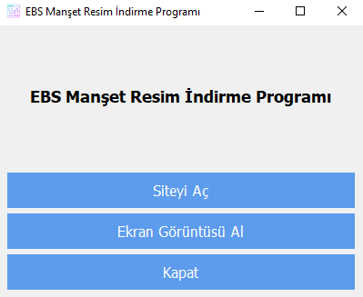

# EBS Manşet Resim İndirme Programı

Bu Python programı, EBS Manşet Resimlerini almak ve indirmek için bir grafiksel kullanıcı arayüzü (GUI) sunar. Program, kullanıcının EBS web sitesini açmasını ve belirli bir alanın ekran görüntüsünü almasını sağlar. Elde edilen ekran görüntüsünü kırpıp kaydeder.

## Proje Görseli



## Özellikler

- **Siteyi Açma**: Kullanıcı, butona tıklayarak EBS web sitesini açabilir.
- **Ekran Görüntüsü Al**: Kullanıcı, açılan siteden ekran görüntüsü alabilir ve kırpılmış olarak kaydedebilir.
- **Çıkış**: Programdan çıkış yapabilirsiniz.

## Gereksinimler

- Python 3.x
- PyQt5
- Selenium
- Pillow
- Webdriver Manager
- Chrome Webdriver

## Kurulum

1. Python yüklü değilse [Python'un resmi sitesinden](https://www.python.org/downloads/) Python'u indirip yükleyin.
2. Gerekli Python kütüphanelerini yüklemek için terminal veya komut istemcisinde aşağıdaki komutu çalıştırın:

    ```bash
    pip install pyqt5 selenium pillow webdriver-manager
    ```

3. Chrome Webdriver'ınızın yüklü olduğundan emin olun. Webdriver, [ChromeDriver Manager](https://github.com/SergeyPirogov/webdriver_manager) tarafından otomatik olarak indirilecektir.

## Kullanım

Programı başlatmak için terminal veya komut istemcisinde aşağıdaki komutu çalıştırın:

```bash
python ebs_manset_indir.py
```

Uygulama açıldıktan sonra aşağıdaki adımları takip edebilirsiniz:
- **Siteyi Aç**: Web sitesini açmak için bu butona tıklayın.
- **Ekran Görüntüsü Al**: Siteyi açtıktan sonra ekran görüntüsünü almak için bu butona tıklayın.
- **Çıkış**: Programdan çıkmak için bu butona tıklayın.

## Yazarlar

- [Adınız](https://github.com/Adiniz)

## Lisans

Bu proje MIT Lisansı ile lisanslanmıştır.
